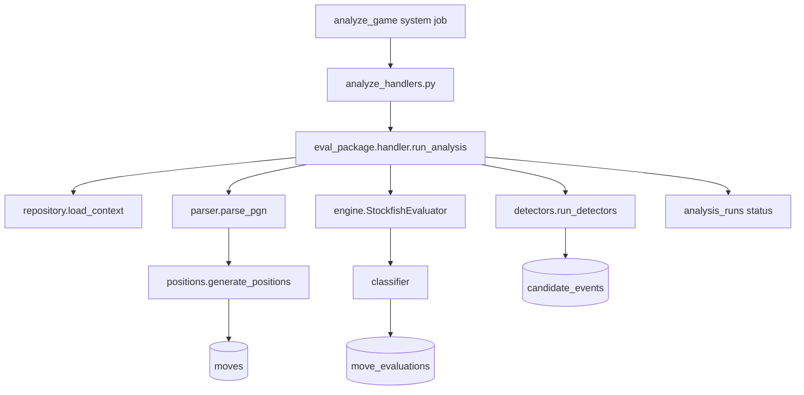

# Evaluation engine

The evaluation engine turns imported PGN games into structured analysis artifacts: moves, engine evaluations, and candidate events. It runs inside the Python worker when an `analyze_game` system job is claimed.

Design spec (requirements and non-goals): [planning/evaluation-engine.md](planning/evaluation-engine.md).

## End-to-end flow

1. Rails enqueues `analyze_game` after import ([`app/services/analysis_runs/bulk_enqueue_for_import.rb`](../app/services/analysis_runs/bulk_enqueue_for_import.rb)).
2. The worker handler opens a DB connection and calls `run_analysis`.
3. The run is marked `running`, PGN is parsed, and moves are inserted once per game (idempotent).
4. Stockfish evaluates **user moves only** at the configured depth (default 15).
5. Detectors run per move and insert `candidate_events`.
6. On success the run is `succeeded`; structured errors mark it `failed`.

Moves are **game-scoped** (parsed once). Evaluations and candidate events are **run-scoped** (one row set per `analysis_run`).

## Package layout

All code lives under [`analysis/worker/eval_package/`](../analysis/worker/eval_package/).

| Module          | Role                                                                    |
| --------------- | ----------------------------------------------------------------------- |
| `handler.py`    | Orchestrates parse → eval → detect → persist in one transaction         |
| `repository.py` | Load game/run context; SQL inserts; run lifecycle                       |
| `parser.py`     | PGN → `ParsedMove` list (SAN, UCI, ply, clocks, `played_by_user`)       |
| `positions.py`  | Replay moves → `fen_before` / `fen_after` per ply                       |
| `engine.py`     | Stockfish UCI wrapper; user-POV evals; mate → centipawn conversion      |
| `classifier.py` | Centipawn loss, classification thresholds, time-control weight metadata |
| `detectors/`    | Rule-based candidate event detectors (one module per event type)        |
| `constants.py`  | Integer enums matching Rails models; CPL thresholds; time weights       |
| `errors.py`     | `InvalidPgnError`, `EngineTimeoutError`, etc.                           |

The thin job entry point is [`analysis/worker/analyze_handlers.py`](../analysis/worker/analyze_handlers.py), registered in [`analysis/worker/handlers.py`](../analysis/worker/handlers.py).

## Module details

### Parser (`parser.py`)

- Uses `python-chess` (`chess.pgn`) to read the game.
- Extracts `[%clk]` annotations when present (seconds remaining).
- Sets `played_by_user` from `games.user_color`.
- Raises `InvalidPgnError` for empty, corrupt, or incomplete PGN.

### Position generator (`positions.py`)

- Replays parsed moves on a `chess.Board`.
- Produces `MovePosition` records with `fen_before` and `fen_after`.
- All moves are persisted; only user moves receive engine evaluation.

### Engine (`engine.py`)

- Spawns Stockfish via `chess.engine.SimpleEngine.popen_uci`.
- Fixed options for determinism: `Threads=1`, `Hash=64`, depth from `analysis_runs.depth`.
- For each user move:
  - Analyze `fen_before` → `eval_before_cp`, best move, PV
  - Analyze `fen_after` → `eval_after_cp`
- Normalizes scores to **user's perspective** (flip sign when user is black).
- Mate scores map to centipawns for CPL math (`±10000 - distance × 100`).
- `ENGINE_TIMEOUT_SECONDS` (default 30) per position; timeout → `EngineTimeoutError`.

### Classifier (`classifier.py`)

- `centipawn_loss = max(0, eval_before - eval_after)` in user POV.
- Classification thresholds (configurable in `constants.py`):

| Classification | Centipawn loss |
| -------------- | -------------- |
| good           | &lt; 50        |
| inaccuracy     | 50–99          |
| mistake        | 100–299        |
| blunder        | ≥ 300          |

- Time-control weight stored in `move_evaluations.metadata` (not applied to classification in M4):

| Time class        | Weight |
| ----------------- | ------ |
| classical / rapid | 1.0    |
| blitz             | 0.75   |
| bullet            | 0.25   |
| unknown           | 1.0    |

### Detectors (`detectors/`)

Each detector returns zero or more `CandidateEventData` objects (`event_type`, `severity`, `confidence`, `metadata`). They do **not** assign weakness themes (Milestone 5).

| Detector            | Signal                                                         |
| ------------------- | -------------------------------------------------------------- |
| `material.py`       | Material delta after the user's move                           |
| `tactical.py`       | High CPL + missed capture/check in engine line, or bad capture |
| `threat.py`         | User's hanging pieces before move + meaningful CPL             |
| `king_safety.py`    | Delayed castling, open files toward king                       |
| `pawn_structure.py` | New doubled / isolated / dangerous passed pawns                |
| `endgame.py`        | Phase transition (e.g. queens off, low material)               |
| `time_pressure.py`  | Clock below threshold for time class (skipped when no clock)   |

Registry: `detectors/__init__.py` → `run_detectors()`.

### Repository (`repository.py`)

- `mark_running` / `mark_succeeded` / `mark_failed` for `analysis_runs`.
- `insert_moves` skips when the game already has move rows.
- `insert_move_evaluation` and `insert_candidate_event` keyed by `analysis_run_id`.
- Failures store `error_message` and structured `error_details`.

## Rails consumption

- **Enqueue:** import batch completion → `AnalysisRuns::BulkEnqueueForImport`
- **Read-only UI:** [`GamesController`](../app/controllers/games_controller.rb) index (analysis status badge) and show (move list + classification badges from latest succeeded run)

## Configuration

| Variable                 | Purpose                                  |
| ------------------------ | ---------------------------------------- |
| `STOCKFISH_PATH`         | Path to Stockfish binary                 |
| `ENGINE_TIMEOUT_SECONDS` | Per-position timeout (default 30)        |
| `DATABASE_*`             | PostgreSQL connection (same DB as Rails) |

## Testing

| Layer                 | Location                                                                                                         |
| --------------------- | ---------------------------------------------------------------------------------------------------------------- |
| Unit                  | `analysis/tests/test_parser.py`, `test_classifier.py`, `test_detectors.py`, …                                    |
| Stockfish integration | `analysis/tests/test_engine_integration.py`, `test_analyze_handler_integration.py` (skipped when binary missing) |
| Rails E2E slice       | `spec/integration/analysis_pipeline_spec.rb` (skipped without Stockfish + Python deps)                           |
| Request specs         | `spec/requests/games_spec.rb`                                                                                    |

Run Python tests: `make test-python`. Full suite: `make test`.

## Determinism

Same PGN + Stockfish version + depth → identical `centipawn_loss`, `classification`, and event counts. Integration tests assert metric equality across two runs on the same game.
