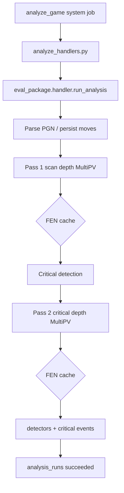

# Evaluation engine

The evaluation engine turns imported PGN games into structured analysis artifacts: moves, engine evaluations, and candidate events. It runs inside the Python worker when an `analyze_game` system job is claimed.

Design spec (requirements and non-goals): [planning/evaluation-engine.md](planning/evaluation-engine.md).

## End-to-end flow

```mermaid
flowchart TD
  Job[analyze_game system job] --> Handler[analyze_handlers.py]
  Handler --> Run[eval_package.handler.run_analysis]
  Run --> Parse[Parse PGN / persist moves]
  Parse --> Pass1[Pass 1 scan depth MultiPV]
  Pass1 --> Cache1{FEN cache}
  Cache1 --> Crit[Critical detection]
  Crit --> Pass2[Pass 2 critical depth MultiPV]
  Pass2 --> Cache2{FEN cache}
  Cache2 --> Det[detectors + critical events]
  Det --> Succeed[analysis_runs succeeded]
```

1. Rails enqueues `analyze_game` after import ([`app/services/analysis_runs/bulk_enqueue_for_import.rb`](../app/services/analysis_runs/bulk_enqueue_for_import.rb)), skipping games with a matching succeeded run (same analysis version + depths + MultiPV + engine).
2. The worker marks the run `running`, parses PGN, and inserts moves once per game (idempotent).
3. **Pass 1** evaluates every user move at scan depth (`analysis_runs.depth`, default 14) with MultiPV (`analysis_runs.multipv`, default 3), using the FEN cache when possible.
4. **Critical detection** scores candidate gap, CPL, mate misses, winning transitions, time pressure, and detector signals; sets `critical_position` / `criticality_score`.
5. **Pass 2** re-analyzes critical moves at `depth_critical` (default 20), overwriting eval/best/PV/candidates and keeping scan metrics under `metadata.scan_*`.
6. Detectors run on final evals; critical positions also get an `analysis_events` row with `event_type: critical_position`.
7. On success the run is `succeeded` (metadata includes cache hit/miss counts); a deduped `classify_patterns` job is enqueued.

Moves are **game-scoped**. Evaluations and events are **run-scoped**. Position engine results are also cached cross-game in `engine_position_evals`.

## Package layout

All code lives under [`analysis/worker/eval_package/`](../analysis/worker/eval_package/).

| Module             | Role                                                                      |
| ------------------ | ------------------------------------------------------------------------- |
| `handler.py`       | Two-pass orchestration: scan → critical → deepen → detect → persist       |
| `repository.py`    | Load game/run context; SQL inserts/updates; run lifecycle                 |
| `parser.py`        | PGN → `ParsedMove` list                                                   |
| `positions.py`     | Replay moves → `fen_before` / `fen_after`                                 |
| `engine.py`        | Stockfish UCI + MultiPV; user-POV scores; cache-aware `analyze_fen`       |
| `fen_cache.py`     | Normalize FEN keys; read/write `engine_position_evals`                    |
| `critical.py`      | Criticality score + reasons                                               |
| `classifier.py`    | Centipawn loss, classification, time-control weight metadata              |
| `logging_utils.py` | Run/cache/verbose logs (`ANALYSIS_VERBOSE`)                               |
| `detectors/`       | Rule-based candidate event detectors                                      |
| `constants.py`     | Enums, depths, MultiPV, critical thresholds                               |
| `errors.py`        | `InvalidPgnError`, `EngineTimeoutError`, etc.                             |

## Module details

### Engine (`engine.py`)

- Spawns Stockfish via `chess.engine.SimpleEngine.popen_uci`.
- Fixed options: `Threads=1`, `Hash=64`.
- `analyze_position(board, depth, multipv)` → ranked `CandidateLine`s.
- `evaluate_user_move` analyzes before (MultiPV) and after (MultiPV 1), sets `played_is_best`.
- Scores are **user POV**. Mate maps to centipawns for CPL (`±10000 - distance × 100`).
- Lookups go through `EnginePositionCache` when configured.

### FEN cache (`fen_cache.py`)

- Key: first four FEN fields + `engine_name` + `engine_version` + `depth` + `multipv` + `analysis_version`.
- Stores candidate lines only (not played-move CPL). Bumping `analysis_version` invalidates naturally.

### Critical detection (`critical.py`)

Flags critical when score ≥ 0.35 or strong signals fire:

- candidate gap ≥ 150 cp (only-move boost at ≥ 300)
- mistake/blunder CPL
- forced mate missed
- winning / equal→losing transitions
- time pressure
- material / tactical / threat detector signals

### Classifier (`classifier.py`)

- `centipawn_loss = max(0, eval_before - eval_after)` in user POV.

| Classification | Centipawn loss |
| -------------- | -------------- |
| good           | &lt; 50        |
| inaccuracy     | 50–99          |
| mistake        | 100–299        |
| blunder        | ≥ 300          |

### Detectors (`detectors/`)

Unchanged set plus persisted `critical_position` events from `critical.py`.

### Repository (`repository.py`)

- Idempotent move/eval inserts; `update_move_evaluation` for pass 2.
- Early return when the analysis run is already `succeeded`.

## Rails consumption

- **Enqueue:** `AnalysisRuns::BulkEnqueueForImport` / `ReconcileAll` — skip identical succeeded settings; allow re-enqueue when version/depths/MultiPV change.
- **UI:** Games index/show show run status plus mid-run `metadata.phase` (`scan` → `deepen` → `detect` → `complete`). The worker commits phase updates on a separate connection so refreshes see progress before the run finishes.

## Configuration

| Variable                 | Purpose                                           |
| ------------------------ | ------------------------------------------------- |
| `STOCKFISH_PATH`         | Path to Stockfish binary                          |
| `ENGINE_TIMEOUT_SECONDS` | Per-position timeout (default 30)                 |
| `ANALYSIS_VERBOSE`       | `1`/`true` enables per-move pass/cache logs       |
| `SYSTEM_JOB_HEARTBEAT_SECONDS` | Worker lease heartbeat interval (default 30) |
| `DATABASE_*`             | PostgreSQL connection (same DB as Rails)          |

Stuck in-progress `analyze_game` jobs are recovered by `SystemJobs::ReconcileStuckProcessing` (see [system-job-contract.md](planning/system-job-contract.md)).

Defaults (Rails `AnalysisVersions` / Python `constants.py`): scan depth 14, critical depth 20, MultiPV 3, analysis version `1.1.0`.

## Testing

| Layer                 | Location                                                                                                         |
| --------------------- | ---------------------------------------------------------------------------------------------------------------- |
| Unit                  | `test_parser.py`, `test_classifier.py`, `test_detectors.py`, `test_critical.py`, `test_fen_cache.py`              |
| Idempotency           | `test_analyze_idempotency.py`, `test_eval_repository.py`                                                         |
| Stockfish integration | `test_engine_integration.py`, `test_analyze_handler_integration.py` (skipped when binary missing)               |
| Rails                 | `spec/services/analysis_runs/*`, `spec/integration/analysis_pipeline_spec.rb`                                    |

Run Python tests: `make test-python`. Full suite: `make test`.

## Determinism

Same PGN + Stockfish version + depths + MultiPV + analysis version → identical CPL/classification for cache misses; cache hits reuse stored candidates for the same key.
