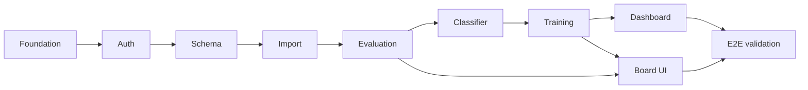

# Phase 1 MVP — Task List

## Milestone 0: Foundation & shared infrastructure

### Rails app bootstrap

- [x] Generate Rails app:

```bash
rails new $PROJECT_NAME \
  -d postgresql \
  -c tailwind \
  -T \
  --skip-system-test \
  --skip-jbuilder \
  --skip-solid \
  --skip-thruster \
  --skip-brakeman \
  --skip-devcontainer
```

- [x] Docker Compose
  - [x] Create `.env` (Rails) and `.env.worker` (Python worker)
  - [x] Add `dotenv-rails`
  - [x] Update `database.yml` to use env vars for Docker
- [x] Redis
  - [x] Update Docker Compose
  - [x] Sidekiq
- [x] Testing stack
  - [x] RSpec
  - [x] Factory Bot
  - [x] Capybara
  - [x] shoulda-matchers
  - [x] database_cleaner
  - [x] selenium-webdriver
- [x] `annotaterb` gem
- [x] ULID id generators
- [ ] Devise (email + password: username, email, password, role, confirmable)
  - [ ] Generate Devise views
  - [ ] letter_opener
  - [ ] Dev + test mailer config
  - [ ] User model specs
  - [ ] Basic user flow system specs
  - [ ] Test user seeds
- [ ] `SystemJob` model (or equivalent) for Python worker coordination and UI status

### Python analysis service

- [x] Python project layout (worker, DB access, config)
- [x] Shared DB connection contract (reads/writes same PostgreSQL as Rails)
- [x] Stockfish binary/path configuration
- [ ] Worker loop: claim `SystemJob` → process → update status/result/errors
- [ ] Document DB contract (status enums, payload/result JSON shapes) so Rails never depends on Python internals

### Cross-cutting

- [ ] Analysis versioning fields on `AnalysisRun` (`engine_version`, `analysis_version`); analysis treated as immutable
- [ ] Seeds: test user, curated puzzles (theme + difficulty + FEN + solution), optional demo games

---

## Milestone 1: Authentication & provider OAuth

Prerequisite: Devise and user flows from Milestone 0.

- [ ] Google OAuth (OmniAuth) — optional for Phase 1; Lichess is the critical provider path
- [ ] Lichess OAuth (OmniAuth) — **MVP**
- [ ] Session/dashboard shell after login

---

## Milestone 2: Domain schema (Rails migrations + models)

Implement entities from [domain-models.md](planning/domain-models.md) with states, associations, and validations.

| Area              | Models                                            |
| ----------------- | ------------------------------------------------- |
| Users & providers | `User`, `ProviderAccount`                         |
| Import            | `ImportBatch`, `ImportRecord`                     |
| Games             | `Game`, `Move`                                    |
| Analysis          | `AnalysisRun`, `MoveEvaluation`, `CandidateEvent` |
| Weaknesses        | `WeaknessEvent`, `WeaknessCycle`                  |
| Training          | `TrainingPlan`, `TrainingAssignment`, `Puzzle`    |
| Progress          | `ProgressSnapshot`                                |
| Jobs              | `SystemJob`                                       |

Per-model tasks (repeat pattern):

- [ ] Migration + model + factories + model specs
- [ ] State machine / enum for lifecycle fields (`ImportBatch`, `AnalysisRun`, `WeaknessCycle`, `TrainingPlan`, `TrainingAssignment`, `SystemJob`)
- [ ] Uniqueness: one active `TrainingPlan` per user; no duplicate `ImportRecord` per provider game
- [ ] Indexes for dashboards (user_id + played_at, weakness_cycle_id, etc.)

**Domain success checkpoint:** DB can answer the 12 questions in domain-models §25 (even if UI is minimal).

---

## Milestone 3: Provider accounts & game import

### Rails (orchestration + UI)

- [ ] Provider settings UI: connect Lichess (OAuth), add Chess.com username
- [ ] `ProviderAccount` CRUD; prevent duplicate connections
- [ ] Import request UI: date range (7 / 14 / 30 days), time controls (bullet/blitz/rapid/classical), max 30 games
- [ ] Create `ImportBatch` + enqueue `SystemJob` (`import_games`)
- [ ] Import status page: running / succeeded / partial / failed + counts + errors

### Python (execution)

- [ ] Lichess API import for authenticated account
- [ ] Chess.com username-based import (no OAuth in MVP)
- [ ] Normalize games to provider-agnostic `Game` records (PGN, opening, played_at, result, color, ratings, time control)
- [ ] `ImportRecord` per game: imported / skipped / failed; update batch counts
- [ ] On success: trigger `AnalysisRun` + `analyze_game` jobs (Rails or Python — pick one owner, document it)

### Tests

- [ ] Rails service specs for import initiation
- [ ] Python unit tests for API parsing; integration test with fixture responses

**PRD checkpoint:** User can connect a provider and import games.

---

## Milestone 4: Evaluation engine (Python)

Pipeline from [evaluation-engine.md](planning/evaluation-engine.md):

- [ ] **Game parser** — PGN → moves, user color, clocks/metadata when present
- [ ] **Position generator** — FEN before/after per move
- [ ] **Engine evaluator** — Stockfish depth 15; evaluate **user moves only**
- [ ] **MoveEvaluation** — eval before/after, centipawn loss, best move, classification (good / inaccuracy / mistake / blunder)
- [ ] **Time control weighting** — classical/rapid 1.0, blitz 0.75, bullet 0.25 (store or apply per docs)
- [ ] **Event detectors** (candidate events only): material, tactical, threat, king safety, pawn structure, endgame phase, time pressure
- [ ] Persist `Move`, `MoveEvaluation`, `CandidateEvent`; mark `AnalysisRun` succeeded/failed
- [ ] Determinism: same PGN + engine version → same artifacts
- [ ] Error handling for corrupt PGN / engine timeout

### Rails

- [ ] Games list + per-game analysis status
- [ ] Game detail: move list with classifications (read-only)

### Tests

- [ ] Pytest: parser, CPL/classification, each detector
- [ ] Integration: Stockfish on fixture PGNs
- [ ] E2E slice: imported game → full analysis artifacts in DB

**PRD checkpoint:** User can analyze imported games.

---

## Milestone 5: Weakness classifier (Python)

From [weakness-classifier.md](planning/weakness-classifier.md) — **MVP themes only**:

- [ ] Classify `CandidateEvent` → `WeaknessEvent` with primary (and optional secondary) theme
- [ ] **Themes (9):** hanging pieces, missed tactics, ignored threats, opening development, king safety, bad trades (materially losing only), pawn structure (MVP signals + eval worsening), endgame technique (MVP signals), time pressure
- [ ] **Exclude** opening family performance from training-plan targeting (not used for plans in MVP)
- [ ] Recurring weakness logic: pattern across games, not single mistakes
- [ ] Detection window: last 30 games / 30 days (configurable constants)
- [ ] Frequency = occurrences / games analyzed
- [ ] Severity model: occurrence + impact + recency
- [ ] `WeaknessCycle` lifecycle: detected → active → improving → managed → archived
- [ ] Enqueue/run `classify_weaknesses` job after analysis batch (or on demand)

### Rails

- [ ] Weakness report UI: top weaknesses, severity, trend
- [ ] Weakness detail: linked games/moves/events

### Tests

- [ ] Unit tests per theme rule (fixtures from doc examples)
- [ ] Integration: analysis artifacts → weakness events + cycles
- [ ] Determinism tests

**PRD checkpoint:** User can view recurring weaknesses.

---

## Milestone 6: Training plans & puzzles

### Data & content

- [ ] Curated `Puzzle` seed set mapped to themes/motifs/difficulty
- [ ] Puzzle metadata: FEN, theme, difficulty, solution, source

### Python — training plan generator

From [training-plan-generator.md](planning/training-plan-generator.md):

- [ ] Rank weakness cycles; surface **top 3** recommendations
- [ ] Rule-based, deterministic plan generation (no AI chat, no adaptive scheduling)
- [ ] On user selection: create 14-day plan targeting one `WeaknessCycle`
- [ ] Daily assignments: **1** personal position review, **5** theme puzzles, **1** play-game assignment; theme-specific habit exercises where defined
- [ ] Personal positions from user's `WeaknessEvent`s; puzzles from curated DB by theme
- [ ] Progress targets: baseline vs current frequency; improving (30%) / managed (75%) thresholds
- [ ] `generate_training_plan` job

### Rails

- [ ] Plan recommendation UI (top 3) → user picks one → single **active** plan
- [ ] Plan lifecycle: start, pause, resume, complete, archive
- [ ] Today's assignments view
- [ ] **Manual** completion tracking (mark complete/skip) — no auto-detect for play-game in MVP
- [ ] Plan extension when target not met after 14 days

### Tests

- [ ] Unit: assignment counts, theme mapping, determinism
- [ ] Integration: weakness cycle → plan + assignments

**PRD checkpoint:** User can select a plan and complete exercises.

---

## Milestone 7: Dashboard & progress tracking

- [ ] **Summary:** ratings by time class, active plan, recent analysis status
- [ ] **Progress snapshots** job (`update_progress_snapshots`): rating, weakness frequency/severity, blunders/game, avg CPL, training completion %
- [ ] **Charts:** rating history, weakness trend, blunders per game, avg CPL (per PRD §13)
- [ ] Retain all imported games/analysis; no re-analysis of historical games when engine version changes
- [ ] Training plan progress panel: objective, daily tasks, % toward improving/managed

**PRD checkpoint:** User can track progress over time.

---

## Milestone 8: Chess board UI (Rails + Hotwire)

Per PRD §14 — no React required:

- [ ] Integrate `chess.js` + `cm-chessboard` via Stimulus
- [ ] View position from FEN
- [ ] Step through game moves
- [ ] Compare played move vs engine best move (game review)
- [ ] Mistake review mode (jump to classified moves)
- [ ] Puzzle solve mode (input solution, basic validation)

Used in: game detail, personal position review, puzzle assignments.

---

## Milestone 9: End-to-end workflow & MVP validation

### Job pipeline (wire all four workflows)

```text
Import → Analyze → Classify → (user picks plan) → Generate plan → Progress snapshots
```

- [ ] Idempotent imports and job retries
- [ ] Partial failure visibility (batch-level + per-game)
- [ ] Rails only reads DB status/artifacts from Python (design principle domain-models §23–24)

### Testing (PRD §16)

- [ ] Rails: model/service/request specs for each workflow step
- [ ] Python: unit + Stockfish integration + PGN→analysis→weakness→plan E2E
- [ ] Capybara system spec: happy path (register → connect → import → wait → weaknesses → plan → complete assignment)

### MVP success criteria (PRD §17)

1. [ ] Connect a provider
2. [ ] Import games
3. [ ] Analyze games
4. [ ] View recurring weaknesses
5. [ ] Select a training plan
6. [ ] Complete exercises
7. [ ] Track progress
8. [ ] Demonstrate measurable reduction in targeted weakness frequency

---

## Out of Phase 1 (PRD non-goals)

- Live assistance, real-time move hints, opening prep tools
- Mobile apps, multiplayer coaching, AI chat coaching
- Auto-generated puzzles from mistakes (curated DB only)
- Multiple simultaneous active plans
- Scheduled/automatic imports (manual import in MVP)
- Opening family performance driving plans
- Billing / premium features

---

## Build order (dependencies)



Parallelize where possible: **M8 (board)** can start once game/move data exists (after M4); **puzzle seeds** can land during M2.

---

## Rough sizing (planning only)

| Milestone | Focus                                        |
| --------- | -------------------------------------------- |
| 0–2       | ~1–2 weeks — scaffold, schema, test harness  |
| 3         | ~1 week — provider APIs                      |
| 4         | ~2 weeks — Stockfish pipeline (highest risk) |
| 5         | ~1–2 weeks — classifier rules                |
| 6–7       | ~1–2 weeks — plans + dashboard               |
| 8–9       | ~1 week — board + E2E polish                 |
