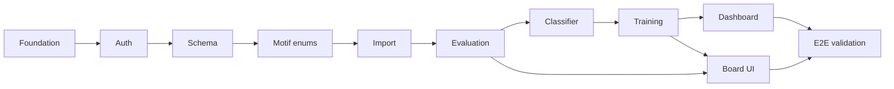

# Phase 1 MVP — Task List

## Milestone 0: Foundation & shared infrastructure

### Rails app bootstrap

- [x] Generate Rails app:

```bash
rails new $PROJECT_NAME \
  -d postgresql \
  -c tailwind \
  -T \
  --skip-system-test \
  --skip-jbuilder \
  --skip-solid \
  --skip-thruster \
  --skip-brakeman \
  --skip-devcontainer
```

- [x] Docker Compose
  - [x] Create `.env` (Rails) and `.env.worker` (Python worker)
  - [x] Add `dotenv-rails`
  - [x] Update `database.yml` to use env vars for Docker
- [x] Redis
  - [x] Update Docker Compose
  - [x] Sidekiq
- [x] Testing stack
  - [x] RSpec
  - [x] Factory Bot
  - [x] Capybara
  - [x] shoulda-matchers
  - [x] database_cleaner
  - [x] selenium-webdriver
- [x] `annotaterb` gem
- [x] ULID id generators
- [x] Devise (email + password: username, email, password, role, confirmable)
  - [x] Generate Devise views
  - [x] letter_opener
  - [x] Dev + test mailer config
  - [x] User model specs
  - [x] Basic user flow system specs
  - [x] Test user seeds
- [x] `SystemJob` model (or equivalent) for Python worker coordination and UI status

### Python analysis service

- [x] Python project layout (worker, DB access, config)
- [x] Shared DB connection contract (reads/writes same PostgreSQL as Rails)
- [x] Stockfish binary/path configuration
- [x] Worker loop: claim `SystemJob` → process → update status/result/errors
- [x] Document DB contract (status enums, payload/result JSON shapes) so Rails never depends on Python internals — [system-job-contract.md](planning/system-job-contract.md)
- **MVP job transport:** Postgres polling only (`system_jobs` is source of truth for status/UI). Redis is wired for Sidekiq and Action Cable, not Python wake-up yet.

---

## Milestone 1: Authentication & provider OAuth

Prerequisite: Devise and user flows from Milestone 0.

- [x] Lichess OAuth (OmniAuth) — **MVP**
- [x] Session/dashboard shell after login
- [ ] **Before production:** encrypt `ProviderAccount` OAuth tokens at rest (Active Record encryption or lockbox) — M1 stores `access_token` plaintext

### Tests (M1 workflows)

- [x] Email sign-up/sign-in → `/dashboard` (system spec)
- [x] Sign out → public `/` landing (system spec)
- [x] Lichess OAuth → new user + linked account on dashboard (service + request + system specs)
- [x] Signed in → Connect Lichess → linked without new user (service + request specs)
- [x] Link Lichess already tied to another user → error (service + request + system specs)
- [x] Unauthenticated `GET /dashboard` → redirect to sign-in (request spec)

---

## Milestone 2: Domain schema (Rails migrations + models)

Implement entities from [domain-models.md](planning/domain-models.md) with states, associations, and validations.

| Area              | Models                                            |
| ----------------- | ------------------------------------------------- |
| Users & providers | `User`, `ProviderAccount`                         |
| Import            | `ImportBatch`, `ImportRecord`                     |
| Games             | `Game`, `Move`                                    |
| Analysis          | `AnalysisRun`, `MoveEvaluation`, `CandidateEvent` |
| Weaknesses        | `WeaknessEvent`, `WeaknessCycle`                  |
| Training          | `TrainingPlan`, `TrainingAssignment`, `Puzzle`    |
| Progress          | `ProgressSnapshot`                                |
| Jobs              | `SystemJob`                                       |

Per-model tasks (repeat pattern):

- [x] `SystemJob` — migration, model, factories, model specs, integration contract specs
- [x] `SystemJob` — lifecycle enums (`pending` → `claimed` → `processing` → terminal)
- [x] `ProviderAccount` — migration, model, factories, model specs (minimal OAuth fields; pulled forward from M1)
- [x] Migration + model + factories + model specs (remaining models)
- [x] State machine / enum for lifecycle fields (`ImportBatch`, `AnalysisRun`, `WeaknessCycle`, `TrainingPlan`, `TrainingAssignment`)
- [x] `AnalysisRun` — `engine_version`, `analysis_version` on migration; treat runs as immutable (required before M4)
- [x] Uniqueness: one active `TrainingPlan` per user; no duplicate `ImportRecord` per provider game
- [x] Indexes for dashboards (user_id + played_at, weakness_cycle_id, etc.)

### Seeds & fixture data (during M2; puzzle content required before M6)

- [x] Curated `Puzzle` seeds — theme, difficulty, FEN, solution, source (parallel once `Puzzle` model exists)
- [x] Optional demo games for local import/analysis dev without provider APIs (helpful from M3–M4)

**Domain success checkpoint:** DB can answer the 12 questions in domain-models §25 (even if UI is minimal).

---

## Milestone 2.5: Puzzle motifs & game phase enums

M2 ships `Puzzle#motif` and `WeaknessEvent#phase` as free-form strings. Promote both to integer-backed enums so seeds, factories, and downstream Python writers share a single contract.

### Schema

- [x] Migration: `puzzles.motif` `string` → `integer` (nullable during backfill, then `NOT NULL`)
- [x] Migration: `weakness_events.phase` `string` → `integer` (nullable during backfill, then `NOT NULL`)
- [x] Data migration: map existing seed/factory string values to enum integers

### Enums (Rails)

- [x] `PuzzleMotifable` concern (or `Puzzle` enum) — align with [evaluation-engine §11](planning/evaluation-engine.md) tactical motifs plus positional/endgame motifs used in seeds:

  `fork`, `pin`, `skewer`, `double_attack`, `discovered_attack`, `discovered_check`, `back_rank_mate`, `removal_of_defender`, `deflection`, `decoy`, `overloaded_piece`, `zwischenzug`, `mate_threat`, `undefended_piece`, `sacrifice`, `piece_activity`, `center_control`, `exposed_king`, `castling_break`, `material_loss`, `isolated_pawn`, `passed_pawn`, `king_and_pawn`, `opposition`, `one_move_win`, `forcing_line`

- [x] `WeaknessEvent#phase` enum: `opening`, `middlegame`, `endgame` (per [evaluation-engine §15](planning/evaluation-engine.md))
- [x] Leave `WeaknessEvent#explanation_key` as `string` (versioned i18n key, not an enum)

### Reference updates

- [x] [`app/models/puzzle.rb`](app/models/puzzle.rb) — enum + validation
- [x] [`app/models/weakness_event.rb`](app/models/weakness_event.rb) — phase enum
- [x] [`db/seeds/02_puzzles.rb`](db/seeds/02_puzzles.rb) — symbol motif values
- [x] [`db/seeds/03_demo_games.rb`](db/seeds/03_demo_games.rb) — n/a (no motif/phase)
- [x] Factories: `puzzles`, `weakness_events`
- [x] Model specs: `puzzle_spec`, `weakness_event_spec`
- [x] [`docs/planning/domain-models.md`](planning/domain-models.md) — document enum values for `motif` and `phase`

### Tests & docs

- [x] Model specs assert enum definitions and reject invalid values
- [x] `bin/rails db:seed` idempotent after enum migration
- [x] Note integer mappings in planning docs for Python consumers (same pattern as `system-job-contract.md`)

**Checkpoint:** No free-form `motif` or `phase` strings remain in app code, seeds, or factories.

---

## Milestone 3: Provider accounts & game import

### Rails (orchestration + UI)

- [x] Provider settings UI: connect Lichess (OAuth), disconnect
- [x] `ProviderAccount` CRUD; prevent duplicate connections (M1 + disconnect in M3)
- [x] Import request UI: date range (7 / 14 / 30 days), time controls (bullet/blitz/rapid/classical), max 30 games
- [x] Create `ImportBatch` + enqueue `SystemJob` (`import_games`)
- [x] Import status page: running / succeeded / partial / failed + counts + errors

### Python (execution)

- [x] Lichess API import for authenticated account
- [x] Normalize games to provider-agnostic `Game` records (PGN, opening, played_at, result, color, ratings, time control)
- [x] `ImportRecord` per game: imported / skipped / failed; update batch counts
- [x] On success: trigger `AnalysisRun` + `analyze_game` jobs (Rails-owned via status page; see `system-job-contract.md`)

### Tests

- [x] Rails service specs for import initiation
- [x] Python unit tests for API parsing; integration test with fixture responses

**PRD checkpoint:** User can connect a provider and import games (Lichess only in M3; Chess.com deferred).

---

## Milestone 4: Evaluation engine (Python)

Pipeline from [evaluation-engine.md](planning/evaluation-engine.md):

- [x] **Game parser** — PGN → moves, user color, clocks/metadata when present
- [x] **Position generator** — FEN before/after per move
- [x] **Engine evaluator** — Stockfish depth 15; evaluate **user moves only**
- [x] **MoveEvaluation** — eval before/after, centipawn loss, best move, classification (good / inaccuracy / mistake / blunder)
- [x] **Time control weighting** — classical/rapid 1.0, blitz 0.75, bullet 0.25 (store or apply per docs)
- [x] **Event detectors** (candidate events only): material, tactical, threat, king safety, pawn structure, endgame phase, time pressure
- [x] Persist `Move`, `MoveEvaluation`, `CandidateEvent`; mark `AnalysisRun` succeeded/failed
- [x] Determinism: same PGN + engine version → same artifacts
- [x] Error handling for corrupt PGN / engine timeout

### Rails

- [x] Games list + per-game analysis status
- [x] Game detail: move list with classifications (read-only)

### Tests

- [x] Pytest: parser, CPL/classification, each detector
- [x] Integration: Stockfish on fixture PGNs
- [x] E2E slice: imported game → full analysis artifacts in DB

### Docs

- [x] new `docs/evaluation-engine.md` doc that outlines how it works as a whole and how each module works

**PRD checkpoint:** User can analyze imported games.

---

## Milestone 5: Weakness classifier (Python)

From [weakness-classifier.md](planning/weakness-classifier.md) — **MVP themes only**:

- [x] Classify `CandidateEvent` → `WeaknessEvent` with primary (and optional secondary) theme
- [x] **Themes (9):** hanging pieces, missed tactics, ignored threats, opening development, king safety, bad trades (materially losing only), pawn structure (MVP signals + eval worsening), endgame technique (MVP signals), time pressure
- [x] **Exclude** opening family performance from training-plan targeting (not used for plans in MVP)
- [x] Recurring weakness logic: pattern across games, not single mistakes
- [x] Detection window: last 30 games / 30 days (configurable constants)
- [x] Frequency = games affected / games analyzed
- [x] Severity model: occurrence + impact + recency
- [x] `WeaknessCycle` lifecycle: detected → active → improving → managed → archived
- [x] Enqueue/run `classify_weaknesses` job after each game analysis (deduped)

### Rails

- [x] Weakness report UI: top weaknesses, severity, trend
- [x] Weakness detail: linked games/moves/events

### Tests

- [x] Unit tests per theme rule (fixtures from doc examples)
- [x] Integration: analysis artifacts → weakness events + cycles
- [x] Determinism tests

### Docs

- [x] new `docs/weakness-classifier-engine.md` doc that outlines how it works as a whole and how each module works

**PRD checkpoint:** User can view recurring weaknesses.

---

## Milestone 6: Training plans & puzzles

### Data & content

- [x] Curated `Puzzle` seed set mapped to themes/motifs/difficulty (see M2 seeds; motif enum in M2.5)
- [x] Puzzle metadata: FEN, theme, difficulty, solution, source

### Python — training plan generator

From [training-plan-generator.md](planning/training-plan-generator.md):

- [x] Rank weakness cycles; surface **top 3** recommendations
- [x] Rule-based, deterministic plan generation (no AI chat, no adaptive scheduling)
- [x] On user selection: create 14-day plan targeting one `WeaknessCycle`
- [x] Daily assignments: **1** personal position review, **5** theme puzzles, **1** play-game assignment; theme-specific habit exercises where defined
- [x] Personal positions from user's `WeaknessEvent`s; puzzles from curated DB by theme
- [x] Progress targets: baseline vs current frequency; improving (30%) / managed (75%) thresholds
- [x] `generate_training_plan` job

### Rails

- [x] Plan recommendation UI (top 3) → user picks one → single **active** plan
- [x] Plan lifecycle: start, pause, resume, complete, archive
- [x] Today's assignments view
- [x] **Manual** completion tracking (mark complete/skip) — no auto-detect for play-game in MVP
- [x] Plan extension when target not met after 14 days

### Tests

- [x] Unit: assignment counts, theme mapping, determinism
- [x] Integration: weakness cycle → plan + assignments

**PRD checkpoint:** User can select a plan and complete exercises.

---

## Milestone 7: Dashboard & progress tracking

- [x] **Summary:** ratings by time class, active plan, recent analysis status
- [x] **Progress snapshots** job (`update_progress_snapshots`): rating, weakness frequency/severity, blunders/game, avg CPL, training completion %
- [x] **Charts:** rating history, weakness trend, blunders per game, avg CPL (per PRD §13)
- [x] Retain all imported games/analysis; no re-analysis of historical games when engine version changes
- [x] Training plan progress panel: objective, daily tasks, % toward improving/managed

**PRD checkpoint:** User can track progress over time.

---

## Milestone 8: Chess board UI (Rails + Hotwire)

Per PRD §14 — no React required:

- [x] Integrate `chess.js` + `cm-chessboard` via Stimulus
- [x] View position from FEN
- [x] Step through game moves
- [x] Compare played move vs engine best move (game review)
- [x] Mistake review mode (jump to classified moves)
- [x] Puzzle solve mode (input solution, basic validation)

Used in: game detail, personal position review, puzzle assignments.

---

## Milestone 9: End-to-end workflow & MVP validation

### Job pipeline (wire all four workflows)

```text
Import → Analyze → Classify → (user picks plan) → Generate plan → Progress snapshots
```

- [ ] Idempotent imports and job retries
- [ ] Partial failure visibility (batch-level + per-game)
- [ ] Rails only reads DB status/artifacts from Python (design principle domain-models §23–24)

### Testing (PRD §16)

- [ ] Rails: model/service/request specs for each workflow step
- [ ] Python: unit + Stockfish integration + PGN→analysis→weakness→plan E2E
- [ ] Capybara system spec: happy path (register → connect → import → wait → weaknesses → plan → complete assignment)
- [ ] Create comprehensive test plan doc from milestone docs
  - [ ] automate userflows as much as possible

### MVP success criteria (PRD §17)

1. [x] Connect a provider
2. [x] Import games
3. [x] Analyze games
4. [x] View recurring weaknesses
5. [x] Select a training plan
6. [x] Complete exercises
7. [x] Track progress
8. [ ] Demonstrate measurable reduction in targeted weakness frequency

---

## Phase 1 Bugs and Polish

- [ ] style action buttons with color in training plans
- [ ] link to overdue tasks from dashboard

## Out of Phase 1 (PRD non-goals)

- Live assistance, real-time move hints, opening prep tools
- Mobile apps, multiplayer coaching, AI chat coaching
- Auto-generated puzzles from mistakes (curated DB only)
- Multiple simultaneous active plans
- Scheduled/automatic imports (manual import in MVP)
- Opening family performance driving plans
- Billing / premium features
- **Redis job wake-up (hybrid queue):** optional signal after enqueue (e.g. `LPUSH` job id); Python worker blocks on Redis then claims in Postgres. `system_jobs` rows remain authoritative for status, retries, errors, and UI—revisit when multiple workers or poll cost matters. See PRD §15.

---

## Build order (dependencies)



Parallelize where possible: **M8 (board)** can start once game/move data exists (after M4); **puzzle seeds** (M2) can land as soon as the `Puzzle` model exists; **motif/phase enums** (M2.5) should land before M6 puzzle selection logic.

---

## Rough sizing (planning only)

| Milestone | Focus                                        |
| --------- | -------------------------------------------- |
| 0–2       | ~1–2 weeks — scaffold, schema, test harness  |
| 2.5       | ~0.5 day — motif/phase enum migration        |
| 3         | ~1 week — provider APIs                      |
| 4         | ~2 weeks — Stockfish pipeline (highest risk) |
| 5         | ~1–2 weeks — classifier rules                |
| 6–7       | ~1–2 weeks — plans + dashboard               |
| 8–9       | ~1 week — board + E2E polish                 |
