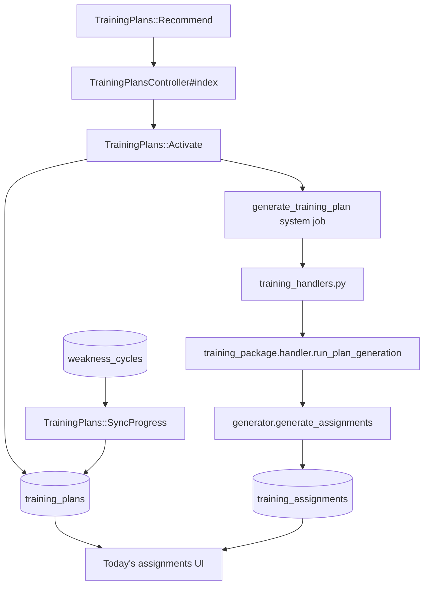

# Training plan engine

The training plan engine turns classified weakness cycles into 14-day improvement programs with daily assignments. It runs inside the Python worker when a `generate_training_plan` system job is claimed.

Design spec: [planning/training-plan-generator.md](planning/training-plan-generator.md).

## End-to-end flow

1. Rails ranks eligible weakness cycles and shows the top 3 recommendations.
2. The user picks one; `TrainingPlans::Activate` creates an `active` plan and enqueues `generate_training_plan`.
3. Python loads weakness events and curated theme puzzles, then writes 14 days of assignments.
4. Rails shows plan progress and today's tasks; users mark assignments complete or skipped manually.

## Package layout

All code lives under [`analysis/worker/training_package/`](../analysis/worker/training_package/).

| Module          | Role                                                         |
| --------------- | ------------------------------------------------------------ |
| `handler.py`    | Orchestrates plan generation inside a DB transaction         |
| `repository.py` | Load plan/cycle/events/puzzles; persist assignments          |
| `generator.py`  | Pure logic for deterministic daily assignment drafts         |
| `constants.py`  | Daily counts, thresholds, habit prompts, Rails-aligned enums |
| `types.py`      | Dataclasses for plan rows and assignment drafts              |

Rails services live under [`app/services/training_plans/`](../app/services/training_plans/).

## Daily assignment structure

Each plan day includes **8 assignments**:

| Type                       | Count | Source                          |
| -------------------------- | ----- | ------------------------------- |
| `personal_position_review` | 1     | User's `WeaknessEvent`s         |
| `theme_puzzle`             | 5     | Curated `Puzzle`s matching theme |
| `play_game`                | 1     | Prompt only (manual completion) |
| `habit_exercise`           | 1     | Theme-specific thinking prompt  |

14 days × 8 assignments = **112 rows** per initial generation.

Puzzles and personal positions **cycle deterministically** when the pool is smaller than demand.

## Progress thresholds

Aligned with the weakness classifier ([`weakness_package/constants.py`](../analysis/worker/weakness_package/constants.py)):

| Milestone  | Default reduction | Plan status |
| ---------- | ----------------- | ----------- |
| Improving  | 30%               | `improving` |
| Managed    | 75%               | `managed`   |

`TrainingPlans::SyncProgress` copies `weakness_cycle.current_occurrences` into the plan and updates `progress_percentage` on plan show/today views.

## Plan extension

When `ends_at` is in the past and the managed threshold is not met, `TrainingPlans::Extend` adds 14 days and enqueues generation with `extension: true`. The repository appends days 15–28 without duplicating the initial block.

## Idempotency

Initial generation is a no-op if assignments already exist. Extension runs only when `extension: true` is passed in the job payload.

## Testing

| Layer    | Specs |
| -------- | ----- |
| Python   | `analysis/tests/test_training_*.py` |
| Rails    | `spec/services/training_plans/*`, `spec/requests/training_*` |
| Pipeline | `spec/integration/training_plan_pipeline_spec.rb` |

## Seeds

- [`db/seeds/production/01_puzzles.rb`](../db/seeds/production/01_puzzles.rb) — curated puzzles (all environments)
- [`db/seeds/development/07_demo_training.rb`](../db/seeds/development/07_demo_training.rb) — demo active plan (development only)
