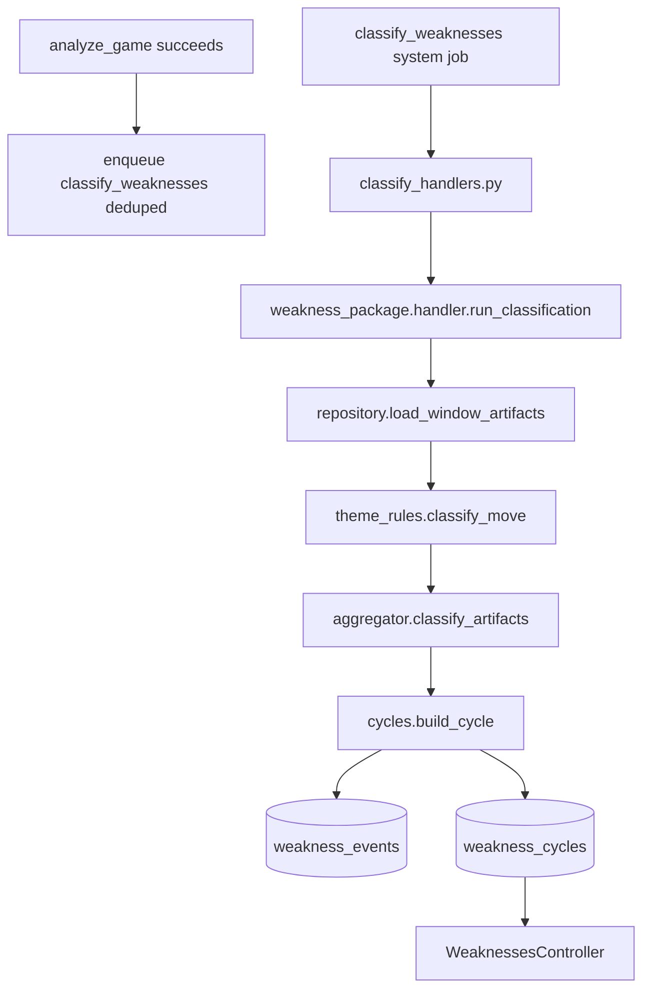

# Weakness classifier engine

The weakness classifier turns evaluation artifacts (`candidate_events`, `move_evaluations`) into player-facing weakness patterns: `weakness_events` and `weakness_cycles`. It runs inside the Python worker when a `classify_weaknesses` system job is claimed.

Design spec (requirements and non-goals): [planning/weakness-classifier.md](planning/weakness-classifier.md).

## End-to-end flow

1. After each successful game analysis, the evaluation handler enqueues a deduped `classify_weaknesses` job for the user.
2. The classifier loads the last 30 analyzed games within 30 days.
3. Per-move theme rules map candidate events + evaluations → classified weaknesses.
4. Events aggregate by theme; cycles receive frequency, severity, and lifecycle status.
5. Rails displays the weakness report at `/weaknesses`.

Each classification run is a **full recompute** for the user (non-archived cycles). Re-running with identical artifacts produces identical metrics.

## Package layout

All code lives under [`analysis/worker/weakness_package/`](../analysis/worker/weakness_package/).

| Module           | Role                                                                 |
| ---------------- | -------------------------------------------------------------------- |
| `handler.py`     | Orchestrates load → classify → aggregate → persist                   |
| `repository.py`  | Read window artifacts; write cycles/events; enqueue classify jobs    |
| `theme_rules.py` | Map candidate events + CPL → primary/secondary theme per move        |
| `aggregator.py`  | Group by theme; severity scoring; standalone time-pressure detection |
| `cycles.py`      | Activation thresholds and lifecycle status                           |
| `constants.py`   | Rails-aligned enums and tunable thresholds                           |
| `types.py`       | Dataclasses for artifacts, classified events, and cycle metrics      |

Job entry point: [`analysis/worker/classify_handlers.py`](../analysis/worker/classify_handlers.py).

## Theme classification

Nine MVP themes (integers in `WEAKNESS_THEME`, matching `WeaknessThemeable` in Rails):

| Theme                 | Primary signals from evaluation engine                          |
| --------------------- | --------------------------------------------------------------- |
| Hanging pieces        | Material loss; threat with ignored hanging pieces               |
| Missed tactics        | Tactical event + minimum CPL (~1.5 pawns)                       |
| Ignored threats       | Threat event + eval worsening                                   |
| Opening development   | King-safety signals in opening (e.g. delayed castling)            |
| King safety           | King-safety signals outside opening window                        |
| Bad trades            | Material loss on captures with eval worsening                     |
| Pawn structure        | Pawn-structure issues + eval worsening                            |
| Endgame technique     | Endgame-phase transition events                                   |
| Time pressure         | Secondary modifier on other themes; standalone when mistake rate under pressure exceeds baseline |

Opening family performance is **not** tracked (reporting-only in the planning doc, excluded from MVP training plans).

## Recurring patterns and cycles

- **Detection window:** last 30 games played within 30 days (configurable in `constants.py`).
- **Deduping:** at most one weakness event per game per theme (highest-severity move kept).
- **Frequency:** `games_affected / games_analyzed` (0–100%, never above 100%).
- **Activation:** ≥ 3 games with the theme across ≥ 2 distinct games promotes a cycle from `detected` → `active`.
- **Severity:** weighted combination of occurrence (frequency), impact (event severity), and recency (exponential decay).
- **Lifecycle:** `detected` → `active` → `improving` (30% reduction) → `managed` (75% reduction) → `archived`.

## Rails consumption

- **Enqueue:** automatically after each `analyze_game` success (deduped per user).
- **UI:** [`WeaknessesController`](../app/controllers/weaknesses_controller.rb) index (top weaknesses) and show (linked games/moves).

## Configuration

Thresholds live in [`analysis/worker/weakness_package/constants.py`](../analysis/worker/weakness_package/constants.py). Key tunables:

| Constant                       | Default | Purpose                              |
| ------------------------------ | ------- | ------------------------------------ |
| `DETECTION_WINDOW_GAMES`       | 30      | Max games in lookback                |
| `DETECTION_WINDOW_DAYS`        | 30      | Max age of games in lookback         |
| `MIN_OCCURRENCES_FOR_ACTIVE`   | 3       | Recurring-pattern activation         |
| `MIN_GAMES_FOR_ACTIVE`         | 2       | Spread across games required         |
| `IMPROVING_THRESHOLD`          | 0.30    | Frequency reduction for improving    |
| `MANAGED_THRESHOLD`            | 0.75    | Frequency reduction for managed      |

## Testing

| Layer                 | Location                                                                                      |
| --------------------- | --------------------------------------------------------------------------------------------- |
| Unit                  | `analysis/tests/test_weakness_theme_rules.py`, `test_weakness_aggregator.py`, `test_weakness_cycles.py` |
| Determinism           | `analysis/tests/test_weakness_determinism.py`                                                 |
| Python integration    | `analysis/tests/test_classify_handler_integration.py`                                         |
| Rails request specs   | `spec/requests/weaknesses_spec.rb`                                                            |
| Rails E2E slice       | `spec/integration/weakness_pipeline_spec.rb` (skipped without Stockfish + Python deps)        |

Run Python tests: `make test-python`. Full suite: `make test`.

## Determinism

Given identical candidate events and move evaluations in the detection window, the classifier produces identical cycle metrics (theme, status, occurrences, severity). No LLM involvement — rule-based only.
